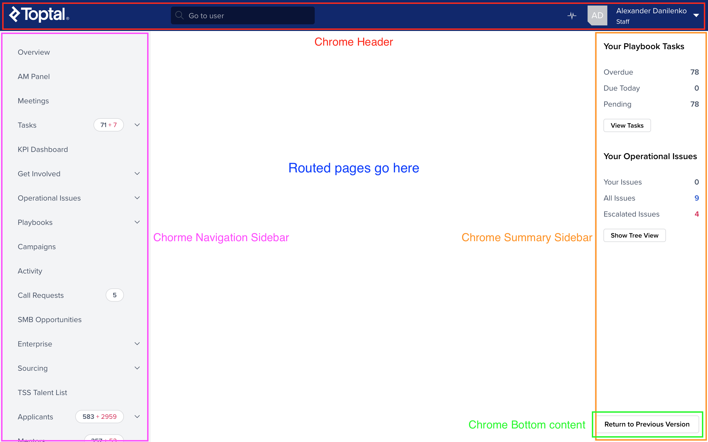
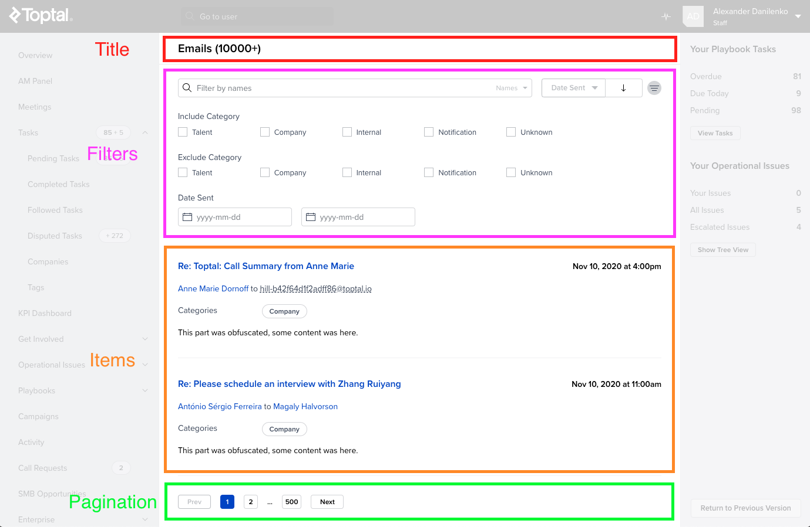

# Staff Portal Architecture

In this document we explain what are the main parts of the application and how
they operate.

## Main 3rd party tools

### Application tools

- React
- @toptal/davinci
- @toptal/picasso
- styled-components
- @toptal/topkit
- React Router
- Apollo
- Final Form
- date-fns

### Tracking tools

- Sentry: error tracking, management and analysis. Access via LastPass.
- LogRocket: user session tracking and recording. Access via LastPass.
- Segment: a hub used by product team for event tracking. Access limited to
  product team.

Any issue trying to access these tools, you can contact `#-itops-help` in Slack

### Development tools

Most of the development experience and its tools is taken care of by Davinci.
Check [Davinci repo](https://github.com/toptal/davinci) to learn more about it.
Other relevant development tools are:

- TypeScript
- GraphQL Code Generator

## App structure

There are 2 main levels in Staff Portal, **Chrome** and **Pages**. And there is
**Routing** happening in between these 2 levels.

### Chrome

Chrome is a center piece of Staff Portal. It is the frame that surrounds every
page, providing fundamental top level features, like navigation, global search
and user menu.

It is composed of 4 main parts: Header, Navigation Sidebar, Summary Sidebar and
Bottom content.

The specific contents of most of its parts depend on the permissions of the
logged in user, and so we need to request user info before these parts are
populated. We can later on access the logged in user data via
`useGetCurrentUser` hook.



#### Header

It is always shown at the top of the application, including the user quick
search, the operation issues button and the user menu. User menu items depend on
current user permissions. We query the API to the generated menu items are the
appropriate ones for the current user.

#### Navigation sidebar (on the left)

It includes links to all pages of the application. Some links also include
counters related to its contents. Some considerations:

- Depending on user permissions, some pages links are hidden. In order to
  achieve this, we do not deal with permissions directly in frontend. Instead,
  API returns the list of links that are allowed for the current user.
- These links might lead to new or old staff portal, depending on the progress
  of the beta. Read more on [Beta Switching Docs](./app/README.md)

#### Summary sidebar (on the right)

It includes up to 4 widgets (SalesToolsWidget, PlaybookTasksWidget,
OperationalIssuesWidget, TeamTaskMetricsWidget), depending on user permissions.
Again, we do not deal with permissions directly in frontend. Instead, API
returns data corresponding to the widgets that we need to display for the
current user.

#### Bottom content

It includes several unrelated features needed at a global scope, like:

- The [Beta Switcher](./app/README.md) button
- The Production Warning Banner, an extra heads up that we are operating with
  real data in production environment.

### Routing

Routing is based in a classic react-router schema with an extra
[@topkit/router](https://github.com/toptal/topkit/tree/master/packages/router)
layer. The configured `@topkit/router` provides a `Link` component that takes
care of transforming the target url, telling apart links needs to point to
old/new Staff Portal. There is also a `EnabledRoutesGuard` component that takes
care of redirecting to "Not Found" page if a certain page is not beta enabled.

There is also a `navigation-service`. It is an abstraction over routing and URL manipulation

Read more about beta routes in the [Beta Switching docs](./app/README.md)

### Pages

Pages can be very different depending on their purpose. One thing they all share
is a common structure on the page title. And pages that display a list of items
also have similar structure.

#### Page title

For the page title, we use the `ContentWrapper` component. This component does
not only take care of setting the page title and actions, it also:

- Sets the browser title
- Takes care of status messages
- Includes a React error boundary to catch errors at this level

#### List pages

They mostly have a common structure:

- Page title - `ContentWrapper` component
- Filters - `Filters` component
- Items - `ItemsList` component
- Pagination - `Pagination` component



Although these components cover most cases, you can use different ones if
needed. There is also the possibility to "explode" `Filters` into its composing
components for complex layouts.

We also use the `useQueryParamsState` hook from
`@staff-portal/query-params-state` to connect the list-page related
state to the URL search params.

## Operations Modals

Whenever a user is going to perform an action that requires specific permissions
(most of them), after clicking the action button, we show modal to enter
required data or a confirmation. But before showing this modal, we need to check
with the API if the operation is still available at the moment of clicking.

In order to handle this situation, we use a Lazy Operation flow. This involves
mainly the `LazyOperation` component. Please have a look at an example use case,
like
[RemoveCallRequestButton](./modules/call-requests/components/RemoveCallRequestButton/RemoveCallRequestButton.tsx)
to see how it works.

## Data layer

We use Apollo Client to perform queries and mutation in Staff Portal. We target
4 different endpoints:

- Staff (GraphQL): main backend service for Staff Portal.
- LENS (GraphQL): service specific to emails data.
- Kipper (Rest): service that provides data for charts.

### Data hooks

We create one custom data hook per query/mutation, which is used in components.
These data hooks always live in a `data` folder, each one in its own folder
within.

To know which endpoint they should target, we use their context, like this:
`useQuery(…,{ context: { type: LENS_CONTEXT } })`

The extension of the data hook file must include the name of the target
endpoint, like `example-data-hook.staff.gql.ts`. We use this during type
generation with GraphQL Code Generator, in order to know which schema should
each operation use.

We can also use the context to batch queries, using a batch key:

```ts
  import { BATCH_KEY } from '@staff-portal/data-layer-service'

  ...

  useQuery(…,{ context: { [BATCH_KEY]: SOME_BATCH_KEY } })
```
