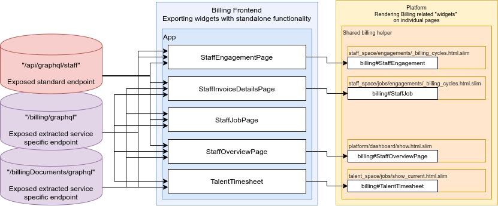

<!-- markdownlint-disable MD041 -->

[](https://github.com/semantic-release/semantic-release)

[](https://app.dependabot.com/accounts/toptal/repos/176710803)
[](https://toptal-core.slack.com/archives/C02T5BTG5)
[](https://toptal-core.slack.com/archives/CJYEJNDU2)

---

# Billing Frontend

Welcome to the Billing Frontend!

This repository represents the distributable package with the Billing-related
functionality, intended to be injected and consumed by any host application,
currently used by `platform`.

## Current approach



# Project Setup

## Prerequisites

You can check it
[here](https://github.com/toptal/platform/blob/master/package.json#L7).

```terminal
  "node": ">= 12.7.0",
  "yarn": ">= 1.22.4"
```

You can check it
[here](https://github.com/toptal/platform/blob/master/.ruby-version).

```terminal
  "ruby": "2.6.5"
```

# Local Commands

| Command                                 | Description                                                                                                               |
| --------------------------------------- | ------------------------------------------------------------------------------------------------------------------------- |
| `yarn build:analyze`                    | Generates bundles for including in a host application and runs the generated JS assets through Webpack Bundle Analyzer    |
| `yarn build`                            | Generates bundles for including in a host application                                                                     |
| `yarn build:watch`                      | Generates bundles in `/dist-package` directory for including in a host application in watch mode                          |
| `yarn check:coverage:generate`          | Generates bundles in `/dist-package` directory for including in a host application                                        |
| `yarn clear:babelCache`                 | Clears `babel-loader` cache folder                                                                                        |
| `yarn clear:coverage`                   | Clears test suite coverage folders                                                                                        |
| `yarn clear`                            | Clears all folders generated during processes                                                                             |
| `yarn combinedCoverage:check`           | Checks the current combined coverage _(Note: it just checks not generating reports)_                                      |
| `yarn combinedCoverage:report`          | Reports the current combined _(Note: it just reports not generating reports)_                                             |
| `yarn combinedCoverage`                 | Complete test and coverage execution in the repository (Includes `Jest` and `Cypress`) process                            |
| `yarn coverage:check`                   | Checks the status against threshold setting (optimized for Jenkins _CI only_)                                             |
| `yarn coverage:report`                  | Reports the status against the threshold setting                                                                          |
| `yarn generate:component`               | Generates a common component file/folder structure (by `Hygen`)                                                           |
| `yarn generate:context`                 | Generates a common context file/folder/structure (by `Hygen`)                                                             |
| `yarn generate:types`                   | Fetches and generates types based on GraphQL schema                                                                       |
| `yarn generate:types:from-local-schema` | Generates type files based on the schema files (settings file: `codegen.yml`)                                             |
| `yarn fetch:graphql-schemas`            | Generates introspecting schema files                                                                                      |
| `yarn lint`                             | Runs `Typescript` check, `prettier-standard`, `eslint`, `stylelint`, `markdownlint`                                       |
| `yarn release`                          | Triggers `semantic-release` process                                                                                       |
| `yarn report:combined:check`            | Checks the again the threshold setting, based on the accessible data in `./.combined-report` folder                       |
| `yarn report:combined:clear`            | Clears `./.nyc_output` & `./.combined-report` directories                                                                 |
| `yarn report:combined:copy`             | Copies required files to a single place to be able to generate a combined report                                          |
| `yarn report:combined:make`             | Creates required folder structure for reporting                                                                           |
| `yarn report:combined:merge`            | Merges together individual report files                                                                                   |
| `yarn report:combined:report`           | Generates a combined report in terminal, based on the accessible data in `./.combined-report` folder                      |
| `yarn report:combined`                  | Prepare everything to be able to run `report:combined:report` or `report:combined:check` commands                         |
| `yarn start:analyze`                    | Fires up a local dev server in watch mode and runs the generated JS assets through Webpack Bundle Analyzer                |
| `yarn start:ci`                         | Fires up local dev server, required by `Cypress` (optimized for Jenkins _CI only_)                                        |
| `yarn start`                            | Runs a local dev server in watch mode using remote API endpoints (staging by default), [see +](./docs/running_locally.md) |
| `yarn start:https`                      | As above, but runs locally on port 443 (https)                                                                            |
| `yarn start:local`                      | Runs a local dev server in watch mode using local API endpoints                                                           |
| `yarn stop`                             | Kills any open dev server instance                                                                                        |
| `yarn install:to-platform`              | Builds the dist. package and forcefully copies itself into local `platform` dependencies, enabling running locally        |
| `yarn install:to-staff-portal`          | Builds the dist. package and forcefully copies itself into local `staff-portal` dependencies, enabling running locally    |
| `yarn test:ci`                          | Runs `Jest`, collects coverage data (optimized for Jenkins _CI only_)                                                     |
| `yarn test:coverage`                    | Runs `Jest` and collects coverage data                                                                                    |
| `yarn test:ui:ci`                       | Runs `Cypress` once in a terminal only mode, based on `electron` browser                                                  |
| `yarn test:ui`                          | Fires up `Cypress` and dev server simultaneously, in watch mode                                                           |
| `yarn test:scopedcoverage`              | Like `test:coverage`, but for a subfolder. How to run: `SCOPE=src/components/ApolloWrapper yarn test:scopedcoverage`      |
| `yarn test`                             | Fires up `Jest` in watch mode                                                                                             |
| `yarn typecheck`                        | Runs `type` check in the repo itself                                                                                      |

# Documents

1. [Local dev environment with various data source](./docs/running_locally.md)
2. [Communication with host environment](./docs/communication_with_host_environment.md)
3. [Jenkins](./docs/jenkins.md)
4. [Platform React](./docs/platform_react.md)
5. [API Authentication](./docs/api_authentication.md)
6. [Environment variables](./docs/env.md)
7. [Security](./docs/security)
8. [FeatureFlags](./docs/feature_flags.md)
9. [GraphQL Schema fetch and types generation](./docs/graphql_schema.md)
10. [Release Process](./docs/release_process.md)
11. [Description how to release](docs/release_to_platform.md)
12. [Insomnia](./docs/insomnia.md)

# Billing Documents

1. [Billing domain: Glossary](https://toptal-core.atlassian.net/wiki/spaces/TEBE/pages/499122854/Billing+domain+Glossary?atlOrigin=eyJpIjoiNGQyNWFiODY1MjkzNGY2NzlhYWVkZmQxZDZhZmNhODAiLCJwIjoiY29uZmx1ZW5jZS1jaGF0cy1pbnQifQ)
2. [Billing: General information](https://toptal-core.atlassian.net/wiki/spaces/TEBE/pages/499156345/Billing+domain+General+information)
3. [Billing domain: Entities diagram](https://toptal-core.atlassian.net/wiki/spaces/TEBE/pages/504136759/Billing+domain+Entities+diagram?atlOrigin=eyJpIjoiZDE1MTE2MjQxZGJjNDVkNGE5OGVlOTlmZTEwYjJiMmYiLCJwIjoiY29uZmx1ZW5jZS1jaGF0cy1pbnQifQ)
4. [Billing: Memorandums](https://toptal-core.atlassian.net/wiki/spaces/TEBE/pages/826049280/Memorandums)

# Services

1. [Sentry - Error logging tool](https://sentry.io/organizations/toptal/issues/?project=1847942)
2. [Jenkins - Billing Dashboard](https://jenkins-build.toptal.net/view/Billing/)
3. [LogRocket - User history recording tool](https://logrocket.com/)
4. [Rollbar - Platform error logging tool](https://rollbar.com/Toptal/?projects=3969&levels=50&levels=40&levels=30&levels=20&levels=10&duration=24h&tz=US%2FEastern&sort=total&order=desc)
5. [Dependabot - Package Updater](https://app.dependabot.com/accounts/toptal/repos/176710803)

# External Resources

1. [Picasso documentation](https://picasso.toptal.net/)
2. [Platform installation](https://github.com/toptal/platform/tree/master/docs/installation)
3. [Frontend General guidlines](https://toptal-core.atlassian.net/wiki/spaces/ENG/pages/329875471/Frontend)
4. [GraphQL Guidelines for frontend-backend communication](https://toptal-core.atlassian.net/wiki/spaces/ENG/pages/396296322/GraphQL+Guidelines+for+frontend-backend+communication)
5. [Git(Hub) Workflow](https://toptal-core.atlassian.net/wiki/spaces/ENG/pages/210567666/Git+Hub+Workflow)
6. [Ramp Up videos](https://drive.google.com/drive/u/1/folders/1NXpLUZ_01sMWSdUy0FmNIhHi2KDCZEiD)
