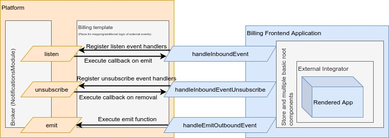

# Main concept

## Diagram of platform usage

## Host application's event handler

In the context of [platform](https://github.com/toptal/platform),
`BillingFrontendApplication` uses `Broker` which is the internal event emitter
of `platform`.

Note: `Broker` is an instance of a preconfigured, `window` exposed alias of
`NotificationsModule`.

Related source files:

- [Notifications.js](https://github.com/toptal/platform/blob/c9523006051677df22ae72d650120a29dac2141d/app/assets/javascripts/platform/framework/base/view_modules/notifications.js#L6)
- [Broker itself](https://github.com/toptal/platform/blob/348d30e9d2cf0da9b71d4b8067304ce980326950/app/assets/features/platform/react_components/components/Notifications/index.js)

## Handling external (inbound) events

`App` component exposes 3 methods:

- `handleInboundEvent`
- `handleInboundEventUnsubscribe`
- `handleOutboundEventEmit`

If defined, the handler methods are accessible within a `useContext` hook.

For reference see:

- [External Integrator Context](https://github.com/toptal/billing-frontend/blob/21b7e24487388b4dffb9e5a7168a27c863754132/src/_lib/context/externalIntegratorContext/index.ts)
- [Example of Usage](https://github.com/toptal/billing-frontend/blob/dbb2625fa12e0cef8bb727f816481127ee70e2e7/src/components/BillingCycleTable/BillingCycleTable.tsx#L93)

### `handleInboundEvent(eventName, payload)`

Sets up a handler for an externally called event.

- `eventName` - string representing a name of the event to listen for
- `payload` - object which includes a callback function invoked when the event
  occurs.

Related types:

- [IHandleInboundEvent](../src/@types/types.ts#L107)

### `handleInboundEventUnsubscribe(eventName, payload)`

Removes a handler for an externally called event.

- `eventName` - string representing a name of the event to stop handling
- `payload` - optional object which should include a callback function invoked
  when handler removal occurs.

Related types:

- [IHandleInboundEventUnsubscribe](../src/@types/types.ts#L108)

## Emitting external (outbound) events

### `handleOutboundEventEmit`

Emits an event that should be handled by the host app.

- `eventName` - string representing the event type to emit
- `payload` - optional object which may contain additional event data.

Related types:

- [handleOutboundEventEmit](../src/@types/types.ts#L62)
