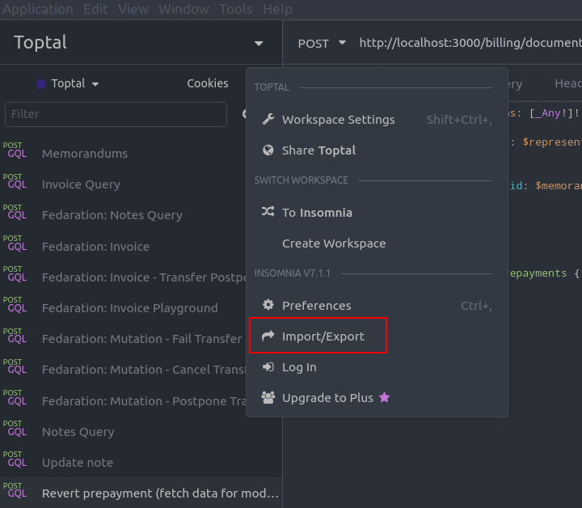
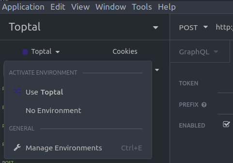
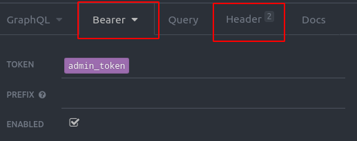

# Insomnia

Insomnia is one of many tools we can use as a client to inspect Graphql network
requests.

More about [insomnia](https://insomnia.rest/)

## Prerequisites

The following steps assume that you have:

- insomnia installed
- platform running
- graphql gateway running
- authentication token & cookie (generate a [token](api_authentication.md))

## Quick start

You can use our common workspace settings to quickly start working with insomnia

### Workspace

1. Download the [insomnia.json](insomnia.json) dump file
2. Open the application menu and select `Import/Export`
   
3. Import the `insomnia.json` to include
4. Follow the [enviroment](#environments) guide and create `admin_token` and
   `admin_cookie` that the pre-defined requests use.

## Exploring insomnia

### Performing a query

1. Click the `+` button and select `New Request`
2. Select `Post` Method and `GraphQL` body content
   
3. Use the endpoint you are interested in in the url input on top
4. Use the large text area to write your query
5. Add the necessary headers (cookie etc...) or/and auth mode
   
6. Click `Send` once you are ready

### Environments

You can use environment variables for things that you might want to set up/use
regularly (i.e. token, values from a `.env` file).

The following steps can also be applied for this specific project:

- Creating an environment can be done by clicking the context menu for the
  environment and selecting `Manage environments`

- Then you can create a json that will include key/value pairs.
- You can later reference any environment variables by using the associated key

